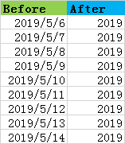
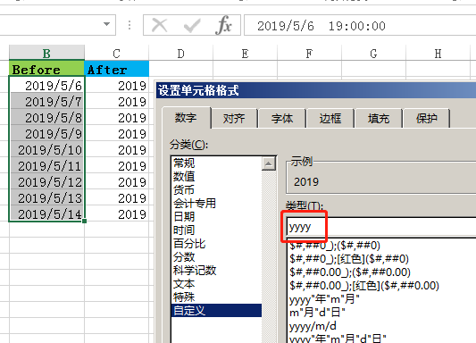
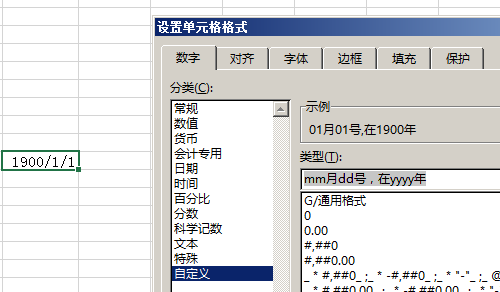

# ![提问][提问]

> 如何在Excel单元格内，将日期只保留年份？



---

# ![回答][回答]

有以下两种做法：

## 1.修改格式

![实现][实现]
- 可通过设置单元格格式实现。
- 选中需要修改的单元格，右击**设置单元格格式**，选择**自定义**分类，在类型中填**yyyy**即可。
 

![进阶][进阶]
- 这里`yyyy`指的是四位数年份，如果要二位数，写`yy`就行。
- 同理，也可以写`mm`表示月份，`hh`表示小时数等等。

![原理][原理]
- 这个的原理是字符串的格式化（正则替换），因此自定义类型可以更随意些，比如输入`mm月dd号，在yyyy年`，可以在示例中看到如下结果：

- 当然，格式化并不能代替字符串拼接，建议只使用Excel自带的那些或稍作修改，可以在分类中来回切换来快速找到。

---

## 2.公式辅助

![实现][实现]
- 可另起一个区域，用统一公式：
```
=--TEXT(单元格,"yyyy")
```

![进阶][进阶]
- **--**：用于快速将字符串转化为数值，不加的话返回值为字符串，无法参与数值计算。
- **TEXT**：此函数与设置单元格格式功能基本相同，第二个参数`yyyy`相当于类型中的格式化字符串。

![原理][原理]
- Excel中的日期和时间，其本质是浮点数值型的时间戳，以**1900年1月1日0点0分0秒**为1.0，每过1天+1。
- 因此，格式不正确的日期时间数据有时会显示为4万多的数值，只要转化一下格式即可。当然，你也可以直接把`40000`这个数转化为`2009/7/6`。


<!-- pics -->
[提问]: ../res/question.png
[回答]: ../res/answer.png
[实现]: ../res/step1.png
[进阶]: ../res/step2.png
[原理]: ../res/step3.png
